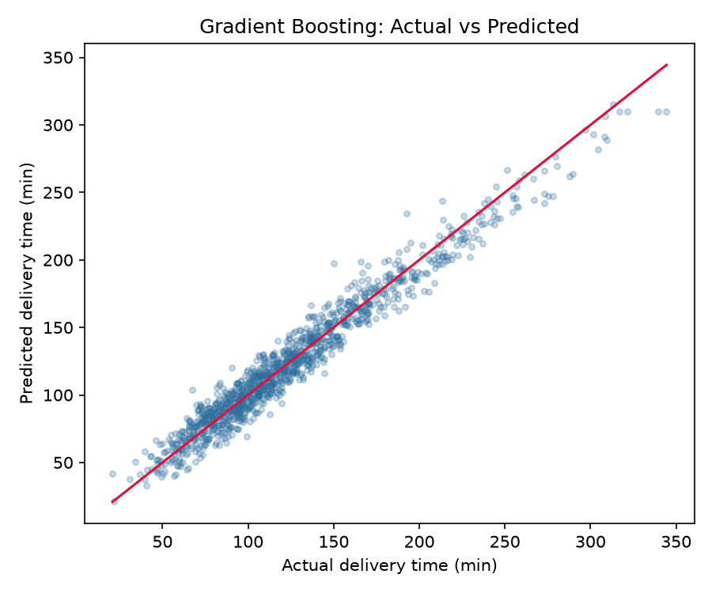
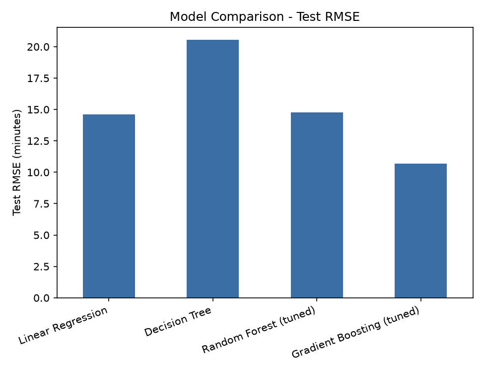
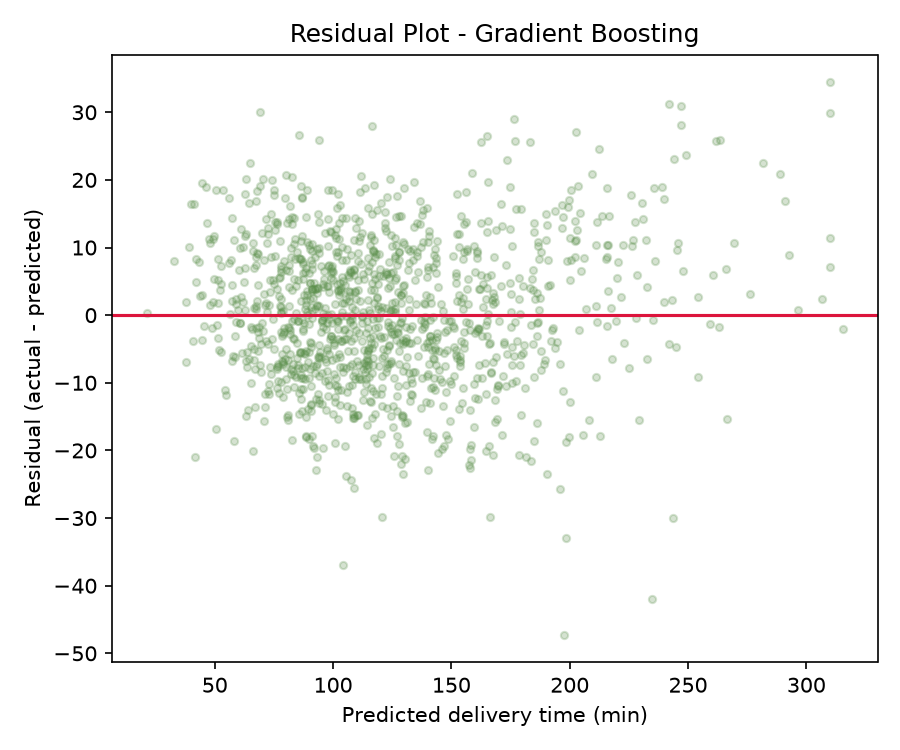
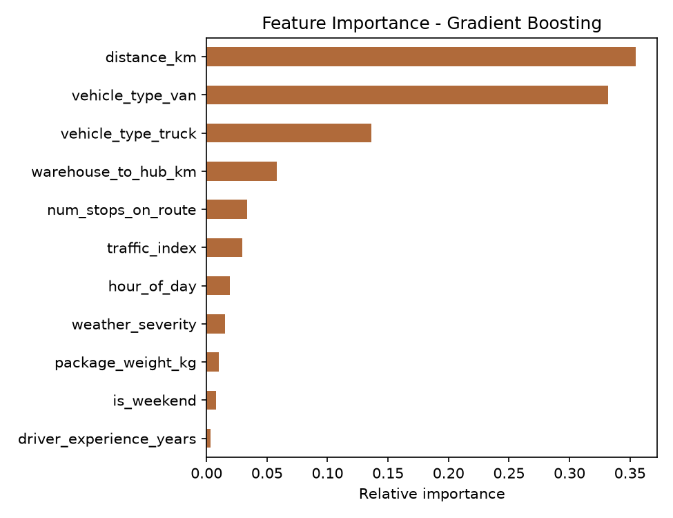
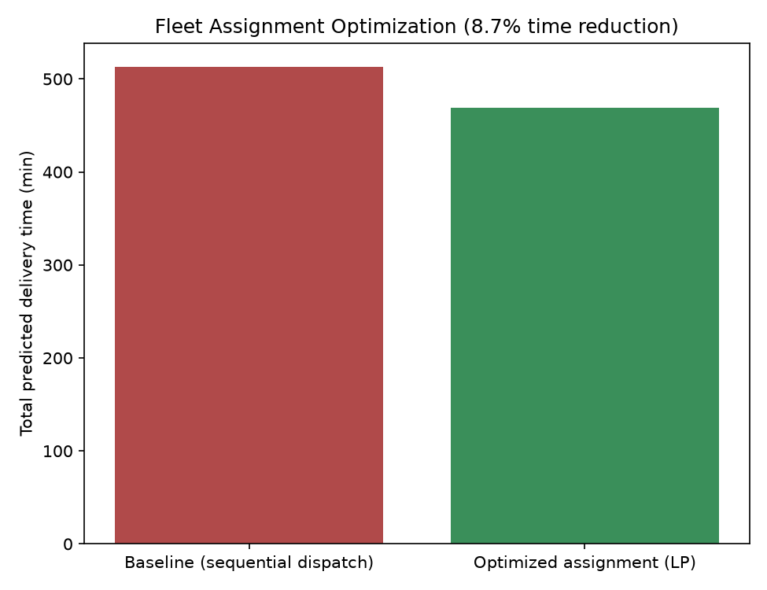
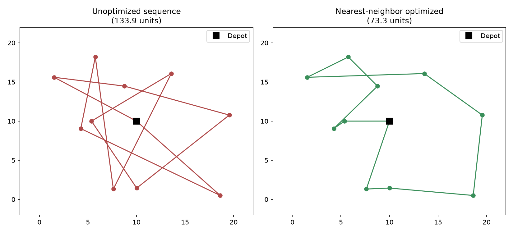

<div align="center">

#  Logistics Delivery-Time Forecasting & Optimization

**Predicting last-mile delivery time with Gradient Boosting, then optimizing fleet assignment and route sequencing on top of it.**

[](https://www.python.org/)
[](https://scikit-learn.org/)
[](https://scipy.org/)
[](https://pandas.pydata.org/)
[](#license)
[](#)



</div>

---

## Overview

This project builds an end-to-end **predictive modeling → optimization** pipeline for a last-mile logistics network:

1. **Forecast** how long a delivery will take (`delivery_time_minutes`) from route, package, and operational features available at dispatch time.
2. **Use the model's own insights** (feature importances) to drive two real operational decisions:
   - 🚐 **Which vehicle to assign to which route** — solved as a linear program (SciPy `linprog`)
   - 🗺️ **What order to visit stops in** — solved with a nearest-neighbor routing heuristic

The result is a single reproducible script that goes from raw (simulated) data → tuned ML model → measurable operational savings, backed by a full written report.

>  **Why this matters:** in a real courier network, a few minutes shaved off every delivery compounds into thousands of driver-hours saved per year. This repo shows the full workflow a data science / operations research team would use to get there.

---

---

##  Problem Statement

Last-mile delivery time is one of the most operationally significant *and* controllable metrics in a logistics network. Unreliable ETAs and inefficient driver/vehicle scheduling directly raise cost-to-serve and hurt customer experience.

**Goal:** predict `delivery_time_minutes` for an individual parcel/route leg, then use that model to answer two operational questions:

- Given today's route batch, **which vehicle type should be dispatched on each route** to minimize total fleet time?
- Given a multi-stop route, **in what order should stops be visited** to minimize distance/time?

---

## Dataset

Since a production logistics dataset wasn't available, a **synthetic dataset of 6,000 delivery records** was generated in NumPy using distributions chosen to mimic real courier operations — e.g. gamma-distributed trip distances, Poisson-distributed stop counts, and a peak-hour congestion bump. The target is a **nonlinear combination** of features plus Gaussian noise, so no model family wins "for free."

| Feature | Type | Description |
|---|---|---|
| `distance_km` | Numeric | Distance for the delivery leg |
| `package_weight_kg` | Numeric | Weight of the parcel |
| `num_stops_on_route` | Integer | Stops on the driver's multi-drop route |
| `traffic_index` | Numeric (0–100) | Congestion severity at dispatch time |
| `weather_severity` | Ordinal (0–3) | 0 = clear … 3 = severe weather |
| `driver_experience_years` | Numeric | Years of driving experience |
| `hour_of_day` | Integer (6–21) | Dispatch hour |
| `is_weekend` | Binary | 1 if Saturday/Sunday |
| `warehouse_to_hub_km` | Numeric | Distance from source warehouse to local hub |
| `vehicle_type` | Categorical | `bike` / `van` / `truck` |
| **`delivery_time_minutes`** | **Numeric (target)** | Actual door-to-door delivery time |

 Generated file: [`simulated_logistics_data.csv`](simulated_logistics_data.csv)

---

## Methodology

```
Simulate data → Feature prep → Train 4 models → Tune & cross-validate → Evaluate
                                                                             ↓
        Route-sequencing heuristic  ←——  Optimization  ——→  Fleet-assignment LP
```

**Models compared** (simple → nonlinear → ensemble, so the "right" model is demonstrated, not assumed):

| Model | Why it's included |
|---|---|
| Linear Regression | Fast, interpretable baseline — tests whether relationships are largely additive |
| Decision Tree | Captures nonlinearity/interactions with minimal preprocessing |
| Random Forest *(tuned)* | Ensemble that reduces variance vs. a single tree |
| **Gradient Boosting *(tuned)*** | Sequentially corrects prior errors — typically strongest on structured/tabular data |

**Validation:** 80/20 train-test split, `GridSearchCV` hyperparameter tuning (3-fold), and 5-fold cross-validation (`KFold`, shuffled) reported for every model to confirm results aren't a lucky split.

**Evaluation metrics:** RMSE, MAE, R².

```python
def evaluate(name, y_true, y_pred, model):
    rmse = np.sqrt(mean_squared_error(y_true, y_pred))
    mae  = mean_absolute_error(y_true, y_pred)
    r2   = r2_score(y_true, y_pred)
    cv = cross_val_score(model, X, y, cv=KFold(5, shuffle=True, random_state=42),
                          scoring="neg_root_mean_squared_error")
    return {"RMSE": rmse, "MAE": mae, "R2": r2,
            "CV_RMSE_mean": -cv.mean(), "CV_RMSE_std": cv.std()}
```

---

##  Results

### Model Comparison

| Model | Test RMSE (min) | Test MAE (min) | Test R² | CV RMSE (mean ± std) |
|---|---:|---:|---:|---:|
| Linear Regression | 14.60 | 11.35 | 0.918 | 15.19 ± 0.46 |
| Decision Tree | 20.54 | 16.01 | 0.837 | 20.84 ± 0.20 |
| Random Forest *(tuned)* | 14.75 | 11.57 | 0.916 | 15.31 ± 0.34 |
| **Gradient Boosting *(tuned)*** | **10.68** | **8.54** | **0.956** | **10.92 ± 0.24** |

*Best hyperparameters — Random Forest: `n_estimators=300, max_depth=None, min_samples_leaf=2`. Gradient Boosting: `n_estimators=300, learning_rate=0.1, max_depth=3`.*

<p align="center">
  
  
</p>

**Gradient Boosting wins outright** — lowest RMSE/MAE, highest R², and a CV standard deviation on par with Linear Regression, meaning the improvement is stable, not a lucky split. The single Decision Tree performs worst, as expected from its tendency to overfit locally while missing smoother interaction effects.

### Feature Importance

<p align="center">
  
</p>

| Rank | Feature | Importance |
|---|---|---:|
| 1 | `distance_km` | 35.5% |
| 2 | `vehicle_type_van` | 33.2% |
| 3 | `vehicle_type_truck` | 13.6% |
| 4 | `warehouse_to_hub_km` | 5.8% |
| 5 | `num_stops_on_route` | 3.4% |
| 6 | `traffic_index` | 3.0% |
| 7 | `hour_of_day` | 2.0% |
| 8 | `weather_severity` | 1.5% |
| 9 | `package_weight_kg` | 1.0% |
| 10 | `is_weekend` | 0.8% |
| 11 | `driver_experience_years` | 0.3% |

**Distance and vehicle type together explain ~82% of predictive power** — and both are directly controllable by the operations team. That insight is exactly what motivates the optimization work below. 

---

##  Optimization Results

### Vehicle-to-Route Assignment (Linear Programming)

Since vehicle type is one of the strongest drivers of delivery time, assigning the *right* vehicle to each route is high-leverage. Formulated as a linear assignment problem — minimize total predicted delivery minutes across a route batch, subject to fleet capacity per vehicle type — and solved with `scipy.optimize.linprog` (HiGHS solver).

<p align="center">
  
</p>

| Policy | Total Fleet Time |
|---|---:|
| Naive sequential dispatch | 513.2 min |
| **LP-optimized assignment** | **468.7 min** |
| **Savings** | ** −8.7%** |

At fleet scale (hundreds of routes/day), an 8–10% reduction in dispatch time translates directly into fewer driver-hours and lower cost-to-serve.

### Stop-Sequencing Optimization (Route Planning)

A nearest-neighbor heuristic (a classic approximate TSP solution) re-orders a 10-stop route to minimize total travel distance.

<p align="center">
  
</p>

| Sequence | Distance |
|---|---:|
| Unoptimized | 133.9 units |
| **Nearest-neighbor optimized** | **73.3 units** |
| **Reduction** | ** −45.2%** |

Stop order alone is a materially large — and often unmanaged — source of delivery-time variance.

---

## Repository Structure

```
logistics-delivery-time-forecasting/
├── logistics_modeling.py                    # Single script: modeling + optimization, end to end
├── simulated_logistics_data.csv              # Generated dataset (6,000 rows)
├── model_comparison_results.csv              # Metrics table for all 4 models
├── feature_importance.csv                    # Gradient Boosting feature importances
├── route_assignment_optimized.csv             # LP-optimized vehicle assignment output
├── Logistics_Predictive_Modeling_Report.docx  # Full written report (methodology + findings)
├── images/                                    # All figures used in this README / report
│   ├── actual_vs_predicted.png
│   ├── residual_plot.png
│   ├── feature_importance.png
│   ├── rmse_comparison.png
│   ├── fleet_assignment_savings.png
│   └── route_sequencing_comparison.png
└── README.md
```

##  Tech Stack

| Purpose | Library |
|---|---|
| Data manipulation | `pandas`, `numpy` |
| Modeling | `scikit-learn` (Linear Regression, Decision Tree, Random Forest, Gradient Boosting) |
| Hyperparameter tuning | `GridSearchCV`, `KFold` cross-validation |
| Optimization | `scipy.optimize.linprog` (HiGHS solver) |
| Visualization | `matplotlib` |

---

##  Key Takeaways

- A tuned **Gradient Boosting Regressor** forecasts delivery time with **RMSE ≈ 10.7 min** and **R² ≈ 0.956**, beating Linear Regression, a Decision Tree, and a Random Forest.
- **Distance and vehicle type** dominate the model's predictions (~82% combined importance) — and both are decisions operations teams actually control.
- A **linear-programming vehicle assignment** cuts total fleet dispatch time by **8.7%** vs. naive sequential dispatch.
- A **nearest-neighbor stop-sequencing heuristic** cuts within-route travel distance by **45.2%**.
- Together, these show that *predictive modeling alone isn't the end goal* — the real value comes from feeding model insight directly into operational decisions.

---

##  Future Improvements

- [ ] Swap in real historical delivery logs and re-validate all metrics
- [ ] Replace the nearest-neighbor heuristic with a full Vehicle Routing Problem (VRP) solver (e.g. OR-Tools) with time windows
- [ ] Extend the LP objective from pure time to a blended cost function (fuel + wages + delay penalty)
- [ ] Deploy the model behind a real-time API so dispatchers get recommendations at route-creation time
- [ ] Add a monitoring loop to track realized vs. predicted delivery time and trigger retraining on drift

---

##  Full Report

A complete written report — covering problem definition, full methodology, evaluation, and optimization recommendations with embedded code — is included:

**[Logistics_Predictive_Modeling_Report.docx](Logistics_Predictive_Modeling_Report.docx)**

---

##  License

This project is licensed under the [MIT License](LICENSE).

---

<div align="center">

*Built as a demonstration of a full predictive-modeling-to-optimization workflow for logistics operations.*

</div>
